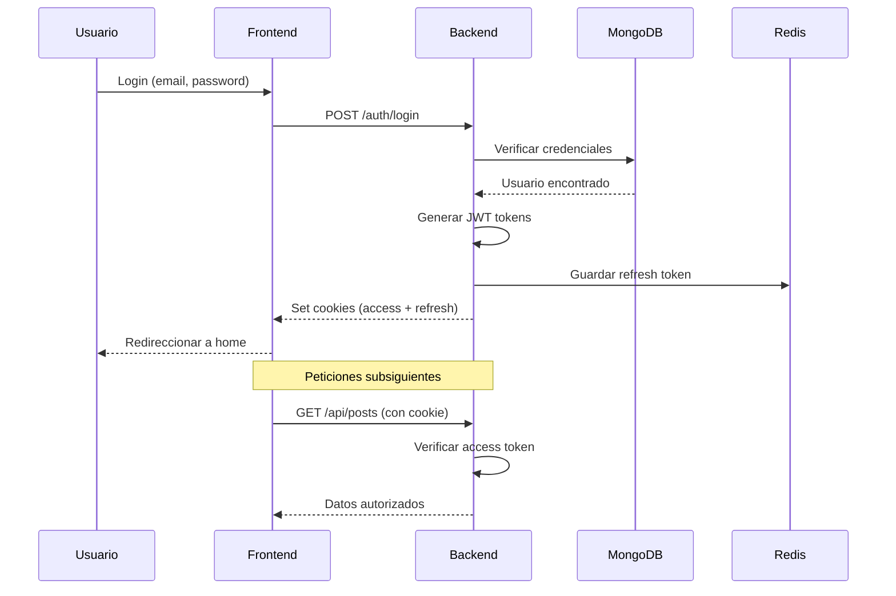
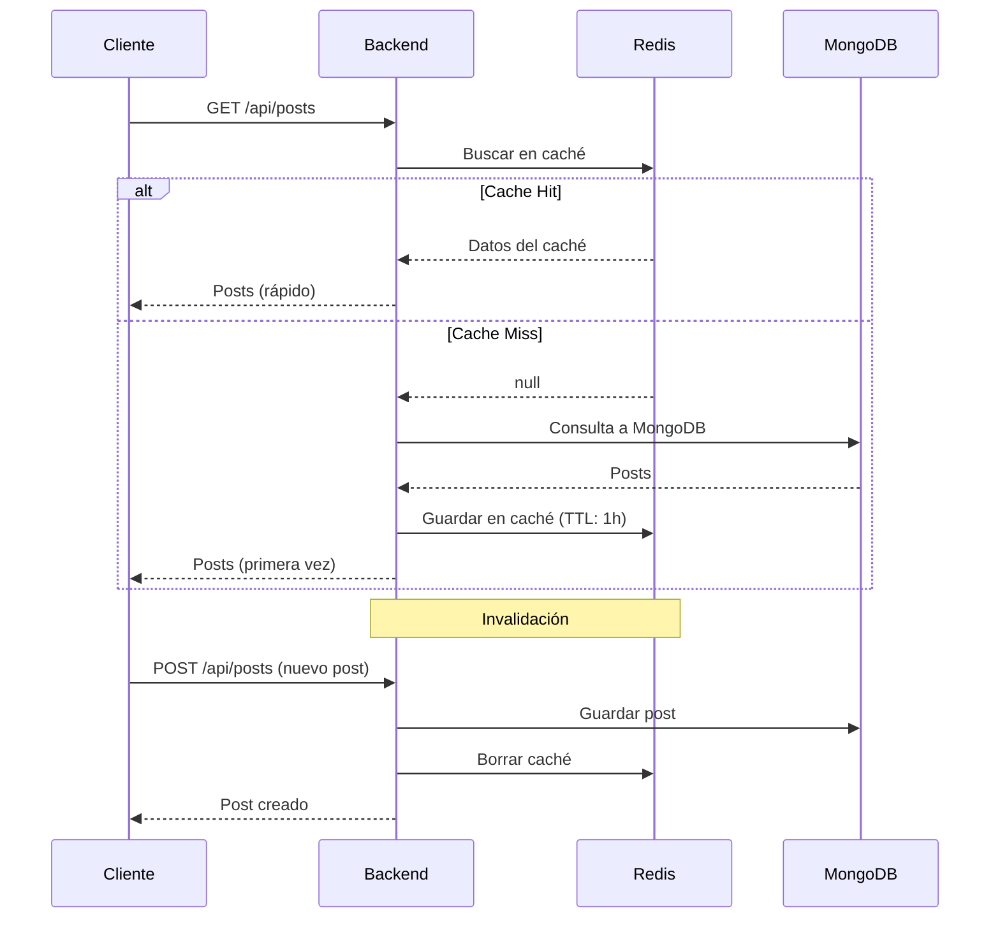

# 🛠️ Guía de Desarrollo - Wanderlust

Esta guía contiene información detallada sobre la estructura del proyecto, flujos de trabajo de desarrollo, testing, y mejores prácticas.

## 📋 Tabla de Contenidos

- [Estructura del Proyecto](#-estructura-del-proyecto)
- [Scripts Disponibles](#-scripts-disponibles)
- [Arquitectura de la Aplicación](#-arquitectura-de-la-aplicación)
- [Flujos de Desarrollo](#-flujos-de-desarrollo)
- [Testing](#-testing)
- [Debugging](#-debugging)
- [Mejores Prácticas](#-mejores-prácticas)
- [Convenciones de Código](#-convenciones-de-código)

---

## 📁 Estructura del Proyecto

### Vista General

```
roxs-wanderlust-ops/
├── backend/              # API REST Node.js + Express
├── frontend/             # React + TypeScript + Vite
├── database/             # Configuración MongoDB
├── kubernetes/           # Manifiestos K8s
├── Assets/               # Recursos y documentación
│   ├── docs/            # Guías y documentación
│   └── imagenes/        # Screenshots y assets
├── docker-compose.yml   # Orquestación local
├── docker-bake.hcl      # Multi-arch builds
└── README.md            # Documentación principal
```

### Backend (`/backend`)

```
backend/
├── api/
│   └── index.js                 # Punto de entrada del API
├── config/
│   ├── db.js                    # Configuración MongoDB
│   ├── utils.js                 # Utilidades de configuración
│   └── swagger.js               # Configuración OpenAPI
├── controllers/
│   ├── auth-controller.js       # Lógica de autenticación
│   └── posts-controller.js      # Lógica de posts
├── models/
│   ├── user.js                  # Schema de Usuario
│   └── post.js                  # Schema de Post
├── routes/
│   ├── auth.js                  # Rutas de auth
│   └── posts.js                 # Rutas de posts
├── services/
│   └── redis.js                 # Cliente Redis
├── utils/
│   ├── cache-posts.js           # Utilidades de caché
│   ├── constants.js             # Constantes de la app
│   ├── cookie_options.js        # Opciones de cookies
│   └── middleware.js            # Middlewares personalizados
├── tests/
│   ├── unit/                    # Tests unitarios
│   ├── integration/             # Tests de integración
│   └── utils/                   # Helpers para tests
├── data/
│   ├── sample_posts.json        # Datos de prueba
│   └── configdb/                # Configuración de DB
├── server.js                    # Servidor Express
├── package.json
└── Dockerfile
```

#### Componentes Clave del Backend

**1. Sistema de Autenticación (`controllers/auth-controller.js`)**
- JWT para autenticación stateless
- bcrypt para hash de contraseñas
- Tokens de acceso y refresh
- Cookies HTTP-only para seguridad

**2. Gestión de Posts (`controllers/posts-controller.js`)**
- CRUD completo de posts
- Filtros por categoría
- Paginación
- Upload de imágenes

**3. Caché con Redis (`services/redis.js`)**
- Caché de posts para mejor performance
- TTL configurable
- Invalidación automática

**4. Base de Datos (`config/db.js`)**
- Mongoose ODM
- Conexión con retry logic
- Migraciones automáticas

### Frontend (`/frontend`)

```
frontend/
├── src/
│   ├── __tests__/               # Tests Jest
│   │   ├── App.test.tsx
│   │   └── integration/
│   ├── assets/                  # Assets estáticos
│   │   └── svg/
│   ├── components/              # Componentes React
│   │   ├── blog-feed.tsx
│   │   ├── featured-post-card.tsx
│   │   ├── latest-post-card.tsx
│   │   ├── post-card.tsx
│   │   ├── hero.tsx
│   │   ├── modal.tsx
│   │   ├── skeletons/          # Skeleton loaders
│   │   └── ui/                 # Componentes UI base
│   ├── config/
│   │   └── jest/               # Configuración Jest
│   ├── constants/
│   │   └── images.ts           # Constantes de imágenes
│   ├── layouts/
│   │   ├── header-layout.tsx
│   │   └── footer-layout.tsx
│   ├── lib/
│   │   ├── types.ts            # Tipos TypeScript
│   │   └── utils.ts            # Utilidades
│   ├── pages/
│   │   ├── home-page.tsx
│   │   ├── details-page.tsx
│   │   ├── add-blog.tsx
│   │   ├── signin-page.tsx
│   │   └── signup-page.tsx
│   ├── types/
│   │   ├── post-type.tsx
│   │   └── test-props.ts
│   ├── utils/
│   │   ├── category-colors.ts
│   │   ├── format-post-time.tsx
│   │   └── slug-generator.ts
│   ├── App.tsx                 # Componente principal
│   ├── main.tsx                # Entry point
│   └── index.css               # Estilos globales
├── public/                      # Assets públicos
├── components.json              # shadcn/ui config
├── jest.config.ts
├── vite.config.ts
├── tailwind.config.js
├── tsconfig.json
└── package.json
```

#### Componentes Clave del Frontend

**1. Routing y Páginas**
- React Router para navegación
- Lazy loading de páginas
- Protected routes para auth

**2. State Management**
- React Context para auth
- Local state con useState/useReducer
- Axios para peticiones HTTP

**3. UI Components**
- shadcn/ui como base
- Tailwind CSS para styling
- Componentes reutilizables

**4. Testing**
- Jest + React Testing Library
- Tests de integración
- Coverage reports

---

## 📜 Scripts Disponibles

### Scripts del Root

| Script | Comando | Descripción |
|--------|---------|-------------|
| `start` | `npm start` | Inicia backend y frontend en paralelo |
| `start-backend` | `npm run start-backend` | Inicia solo el backend |
| `start-frontend` | `npm run start-frontend` | Inicia solo el frontend |
| `installer` | `npm run installer` | Instala todas las dependencias |
| `test` | `npm test` | Ejecuta todos los tests |
| `build` | `npm run build` | Build de producción (front y back) |
| `docker:up` | `npm run docker:up` | Levanta Docker Compose |
| `docker:down` | `npm run docker:down` | Detiene Docker Compose |
| `docker:build` | `npm run docker:build` | Build de imágenes Docker |

### Scripts del Backend

| Script | Comando | Descripción |
|--------|---------|-------------|
| `start` | `npm start` | Inicia el servidor con Nodemon |
| `dev` | `npm run dev` | Modo desarrollo con hot reload |
| `test` | `npm test` | Ejecuta tests con Jest |
| `test:watch` | `npm run test:watch` | Tests en modo watch |
| `test:coverage` | `npm run test:coverage` | Tests con coverage |
| `lint` | `npm run lint` | Ejecuta ESLint |
| `format` | `npm run format` | Formatea código con Prettier |
| `format:check` | `npm run format:check` | Verifica formato sin cambiar |

### Scripts del Frontend

| Script | Comando | Descripción |
|--------|---------|-------------|
| `dev` | `npm run dev` | Inicia Vite dev server |
| `build` | `npm run build` | Build de producción |
| `preview` | `npm run preview` | Preview del build |
| `test` | `npm test` | Ejecuta tests de Jest |
| `test:watch` | `npm run test:watch` | Tests en modo watch |
| `test:coverage` | `npm run test:coverage` | Tests con coverage |
| `lint` | `npm run lint` | Ejecuta ESLint |
| `format` | `npm run format` | Formatea con Prettier |

---

## 🏗️ Arquitectura de la Aplicación

### Flujo de Autenticación



### Flujo de Caché de Posts



### Arquitectura de Componentes Frontend

```
App.tsx
├── Header Layout
│   ├── Navigation
│   ├── Theme Toggle
│   └── Auth Status
├── Router
│   ├── Home Page
│   │   ├── Hero
│   │   ├── Featured Posts
│   │   └── Blog Feed
│   │       ├── Post Card
│   │       ├── Post Card
│   │       └── ...
│   ├── Details Page
│   │   ├── Post Content
│   │   ├── Author Info
│   │   └── Related Posts
│   ├── Add Blog Page
│   │   └── Post Form
│   ├── Sign In Page
│   │   └── Login Form
│   └── Sign Up Page
│       └── Register Form
└── Footer Layout
```

---

## 🔄 Flujos de Desarrollo

### Workflow Típico

1. **Crear rama de feature**
   ```bash
   git checkout -b feature/nueva-funcionalidad
   ```

2. **Desarrollar con hot reload**
   ```bash
   npm start  # Backend + Frontend en paralelo
   ```

3. **Escribir tests**
   ```bash
   # Backend
   cd backend && npm run test:watch
   
   # Frontend
   cd frontend && npm run test:watch
   ```

4. **Verificar código**
   ```bash
   # Lint
   cd backend && npm run lint
   cd frontend && npm run lint
   
   # Format
   cd backend && npm run format
   cd frontend && npm run format
   ```

5. **Commit y push**
   ```bash
   git add .
   git commit -m "feat: descripción del cambio"
   git push origin feature/nueva-funcionalidad
   ```

6. **Crear Pull Request**

### Agregar una Nueva Ruta de API

1. **Definir el controlador** (`backend/controllers/`)
   ```javascript
   // ejemplo-controller.js
   export const getEjemplos = async (req, res) => {
     try {
       const ejemplos = await Ejemplo.find();
       res.json(ejemplos);
     } catch (error) {
       res.status(500).json({ error: error.message });
     }
   };
   ```

2. **Crear la ruta** (`backend/routes/`)
   ```javascript
   // ejemplo.js
   import express from 'express';
   import { getEjemplos } from '../controllers/ejemplo-controller.js';
   import { verifyToken } from '../utils/middleware.js';

   const router = express.Router();

   /**
    * @openapi
    * /api/ejemplos:
    *   get:
    *     summary: Obtener ejemplos
    *     tags: [Ejemplos]
    *     responses:
    *       200:
    *         description: Lista de ejemplos
    */
   router.get('/', verifyToken, getEjemplos);

   export default router;
   ```

3. **Registrar en el servidor** (`backend/server.js`)
   ```javascript
   import ejemploRoutes from './routes/ejemplo.js';
   
   app.use('/api/ejemplos', ejemploRoutes);
   ```

4. **Documentar en Swagger** (automático con JSDoc)

5. **Crear tests**
   ```javascript
   // backend/tests/unit/controllers/ejemplo-controller.test.js
   describe('Ejemplo Controller', () => {
     test('should get ejemplos', async () => {
       // Test implementation
     });
   });
   ```

### Agregar un Nuevo Componente React

1. **Crear el componente** (`frontend/src/components/`)
   ```typescript
   // ejemplo-card.tsx
   import React from 'react';
   
   interface EjemploCardProps {
     title: string;
     description: string;
   }
   
   export const EjemploCard: React.FC<EjemploCardProps> = ({ 
     title, 
     description 
   }) => {
     return (
       <div className="p-4 border rounded">
         <h3>{title}</h3>
         <p>{description}</p>
       </div>
     );
   };
   ```

2. **Crear tipos** (si es necesario)
   ```typescript
   // frontend/src/types/ejemplo-type.tsx
   export interface Ejemplo {
     id: string;
     title: string;
     description: string;
     createdAt: Date;
   }
   ```

3. **Crear tests**
   ```typescript
   // frontend/src/__tests__/ejemplo-card.test.tsx
   import { render, screen } from '@testing-library/react';
   import { EjemploCard } from '../components/ejemplo-card';
   
   describe('EjemploCard', () => {
     it('renders title and description', () => {
       render(
         <EjemploCard 
           title="Test" 
           description="Description" 
         />
       );
       expect(screen.getByText('Test')).toBeInTheDocument();
     });
   });
   ```

4. **Usar en una página**
   ```typescript
   import { EjemploCard } from '../components/ejemplo-card';
   
   export const EjemploPage = () => {
     return (
       <div>
         <EjemploCard title="..." description="..." />
       </div>
     );
   };
   ```

---

## 🧪 Testing

### Estrategia de Testing

```
Backend Testing:
├── Unit Tests (60%)          # Funciones individuales
├── Integration Tests (30%)   # Flujos completos
└── E2E Tests (10%)           # Escenarios de usuario

Frontend Testing:
├── Component Tests (50%)     # Componentes aislados
├── Integration Tests (40%)   # Interacciones
└── E2E Tests (10%)           # Flujos completos
```

### Ejecutar Tests

**Backend:**
```bash
cd backend

# Todos los tests
npm test

# Tests específicos
npm test posts-controller

# Con coverage
npm run test:coverage

# Watch mode
npm run test:watch
```

**Frontend:**
```bash
cd frontend

# Todos los tests
npm test

# Tests específicos
npm test -- App.test

# Con coverage
npm run test:coverage

# Watch mode
npm run test:watch
```

### Escribir Tests Efectivos

**Backend - Test Unitario:**
```javascript
// backend/tests/unit/controllers/posts-controller.test.js
import { getPosts } from '../../../controllers/posts-controller';
import Post from '../../../models/post';

jest.mock('../../../models/post');

describe('Posts Controller - getPosts', () => {
  it('should return all posts', async () => {
    const mockPosts = [{ title: 'Test' }];
    Post.find.mockResolvedValue(mockPosts);
    
    const req = {};
    const res = {
      json: jest.fn(),
      status: jest.fn().mockReturnThis()
    };
    
    await getPosts(req, res);
    
    expect(res.json).toHaveBeenCalledWith(mockPosts);
  });
});
```

**Frontend - Test de Componente:**
```typescript
// frontend/src/__tests__/post-card.test.tsx
import { render, screen } from '@testing-library/react';
import { PostCard } from '../components/post-card';

describe('PostCard', () => {
  const mockPost = {
    _id: '1',
    title: 'Test Post',
    description: 'Description',
    authorName: 'John Doe',
    category: 'Technology'
  };
  
  it('renders post information', () => {
    render(<PostCard post={mockPost} />);
    
    expect(screen.getByText('Test Post')).toBeInTheDocument();
    expect(screen.getByText('Description')).toBeInTheDocument();
    expect(screen.getByText('John Doe')).toBeInTheDocument();
  });
});
```

### Coverage Goals

- **Backend:** Mínimo 80% coverage
- **Frontend:** Mínimo 70% coverage
- **Critical paths:** 100% coverage (auth, payment, etc.)

---

## 🐛 Debugging

### Backend Debugging

**1. Console Logging:**
```javascript
// Usar debug statements estructurados
console.log('[AUTH] User login attempt:', { email: req.body.email });
console.error('[DB] Connection error:', error);
```

**2. VS Code Debugger:**

Crear `.vscode/launch.json`:
```json
{
  "version": "0.2.0",
  "configurations": [
    {
      "type": "node",
      "request": "launch",
      "name": "Debug Backend",
      "skipFiles": ["<node_internals>/**"],
      "program": "${workspaceFolder}/backend/server.js",
      "envFile": "${workspaceFolder}/backend/.env"
    }
  ]
}
```

**3. MongoDB Debugging:**
```javascript
// Activar logs de Mongoose
mongoose.set('debug', true);
```

**4. Redis Debugging:**
```bash
# Monitor en tiempo real
redis-cli monitor

# Ver todas las keys
redis-cli keys "*"
```

### Frontend Debugging

**1. React DevTools:**
- Instalar extensión React DevTools
- Inspeccionar componentes y state
- Profiler para performance

**2. Network Tab:**
- Verificar peticiones HTTP
- Ver headers y cookies
- Timing de requests

**3. Console Debugging:**
```typescript
// Debug renders
useEffect(() => {
  console.log('[PostCard] Rendering with:', post);
}, [post]);

// Debug state changes
console.log('[App] State updated:', { user, isAuthenticated });
```

**4. Source Maps:**
```typescript
// vite.config.ts ya incluye source maps
export default defineConfig({
  build: {
    sourcemap: true
  }
});
```

---

## ✅ Mejores Prácticas

### Código Backend

1. **Validación de Input:**
   ```javascript
   import Joi from 'joi';
   
   const postSchema = Joi.object({
     title: Joi.string().min(3).max(100).required(),
     description: Joi.string().min(10).required()
   });
   
   const { error } = postSchema.validate(req.body);
   if (error) return res.status(400).json({ error: error.details[0].message });
   ```

2. **Error Handling:**
   ```javascript
   // Middleware de error global
   app.use((err, req, res, next) => {
     console.error(err.stack);
     res.status(500).json({ error: 'Something went wrong!' });
   });
   ```

3. **Async/Await:**
   ```javascript
   // Usar try-catch siempre
   export const getPost = async (req, res) => {
     try {
       const post = await Post.findById(req.params.id);
       if (!post) return res.status(404).json({ error: 'Not found' });
       res.json(post);
     } catch (error) {
       res.status(500).json({ error: error.message });
     }
   };
   ```

4. **Seguridad:**
   ```javascript
   // Sanitizar inputs
   import mongoSanitize from 'express-mongo-sanitize';
   app.use(mongoSanitize());
   
   // Rate limiting
   import rateLimit from 'express-rate-limit';
   const limiter = rateLimit({
     windowMs: 15 * 60 * 1000, // 15 minutos
     max: 100 // 100 requests
   });
   app.use('/api/', limiter);
   ```

### Código Frontend

1. **Type Safety:**
   ```typescript
   // Definir todos los tipos
   interface Post {
     _id: string;
     title: string;
     description: string;
     authorName: string;
     category: string;
     image?: string;
     createdAt: Date;
   }
   
   // Usar en componentes
   const PostCard: React.FC<{ post: Post }> = ({ post }) => {
     // TypeScript te protege aquí
   };
   ```

2. **Custom Hooks:**
   ```typescript
   // Reutilizar lógica
   const usePosts = () => {
     const [posts, setPosts] = useState<Post[]>([]);
     const [loading, setLoading] = useState(true);
     
     useEffect(() => {
       fetchPosts().then(setPosts).finally(() => setLoading(false));
     }, []);
     
     return { posts, loading };
   };
   ```

3. **Memoization:**
   ```typescript
   // Evitar re-renders innecesarios
   const MemoizedCard = React.memo(PostCard);
   
   // Callbacks estables
   const handleClick = useCallback(() => {
     // ...
   }, [dependencies]);
   ```

4. **Lazy Loading:**
   ```typescript
   // Lazy load páginas
   const HomePage = lazy(() => import('./pages/home-page'));
   
   <Suspense fallback={<Loading />}>
     <HomePage />
   </Suspense>
   ```

---

## 📝 Convenciones de Código

### Nombres de Archivos

- **Backend:** `kebab-case.js` (ej: `auth-controller.js`)
- **Frontend React:** `kebab-case.tsx` (ej: `post-card.tsx`)
- **Tipos:** `kebab-case.tsx` (ej: `post-type.tsx`)
- **Constantes:** `kebab-case.ts` (ej: `category-colors.ts`)

### Nombres de Variables

```javascript
// camelCase para variables y funciones
const userName = 'John';
const getUserPosts = () => {};

// PascalCase para clases y componentes
class PostController {}
const PostCard = () => {};

// UPPER_SNAKE_CASE para constantes
const API_BASE_URL = 'http://...';
const MAX_FILE_SIZE = 5 * 1024 * 1024;
```

### Imports

```javascript
// Backend
import express from 'express';
import jwt from 'jsonwebtoken';
import Post from '../models/post.js';
import { verifyToken } from '../utils/middleware.js';

// Frontend
import React, { useState, useEffect } from 'react';
import { PostCard } from '../components/post-card';
import type { Post } from '../types/post-type';
```

### Commits

Seguir [Conventional Commits](https://www.conventionalcommits.org/):

```
feat: agregar endpoint de comentarios
fix: corregir bug en autenticación
docs: actualizar README
style: formatear código
refactor: simplificar lógica de caché
test: agregar tests de posts
chore: actualizar dependencias
```

---

## 🔗 Referencias

- [Guía de Inicio](GETTING-STARTED.md) - Setup inicial
- [Docker Compose](DOCKER-COMPOSE-GUIDE.md) - Desarrollo con Docker
- [Kubernetes](KUBERNETES-GUIDE.md) - Deploy en K8s
- [Swagger](SWAGGER-GUIDE.md) - Documentación del API
- [Contribuir](CONTRIBUTING.md) - Cómo contribuir al proyecto

---

**¡Happy Coding! 🚀**
