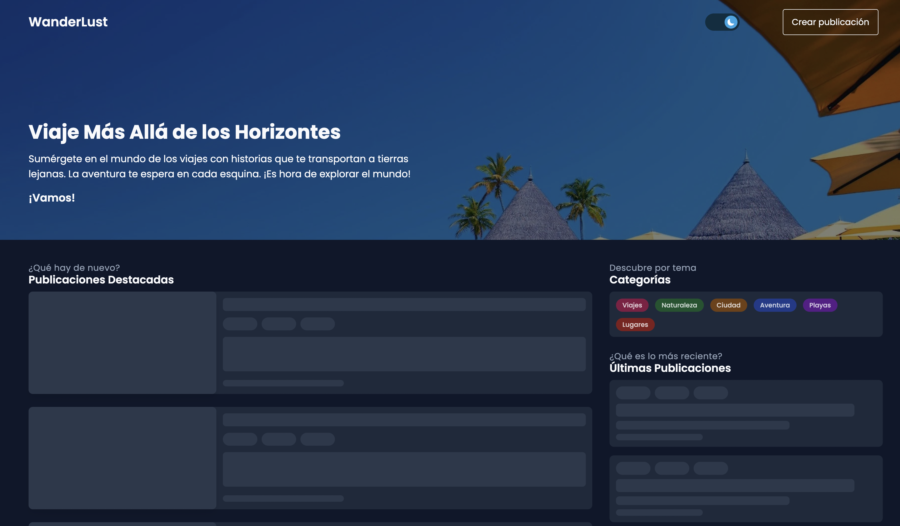
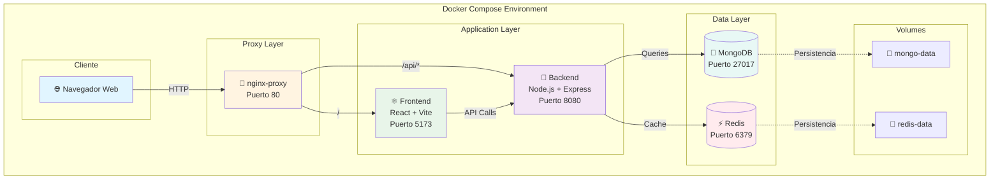
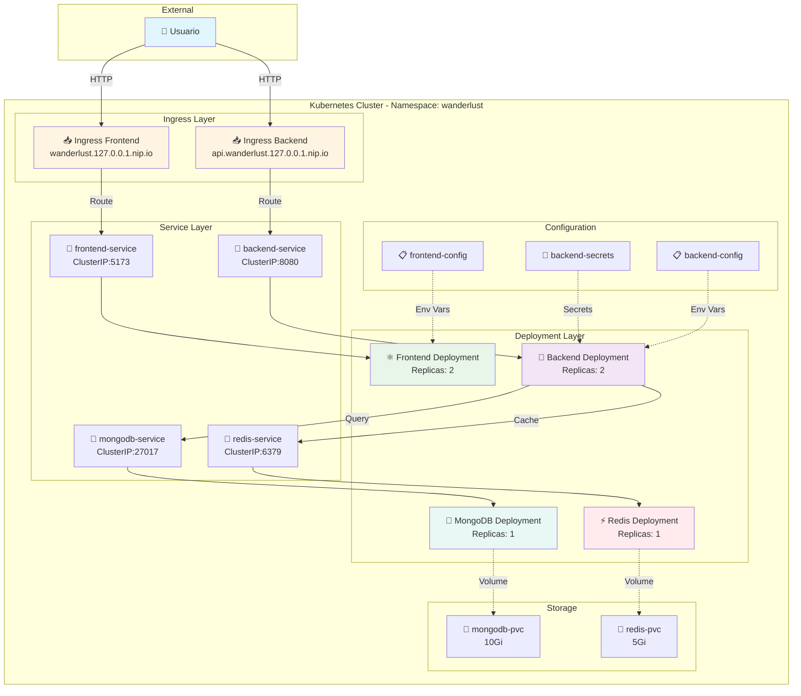
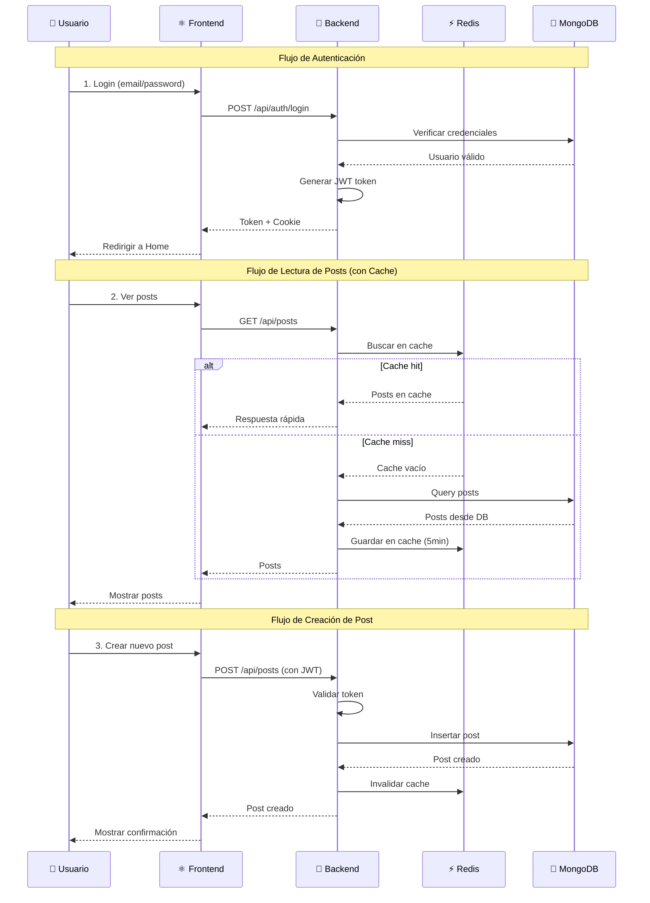
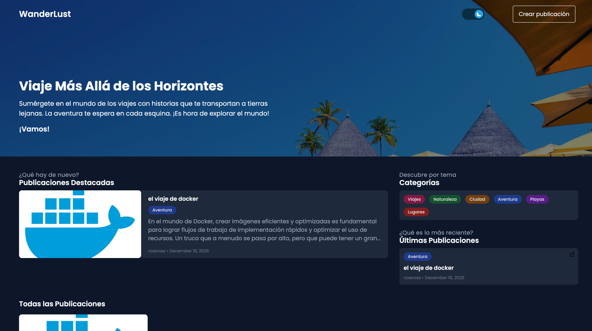
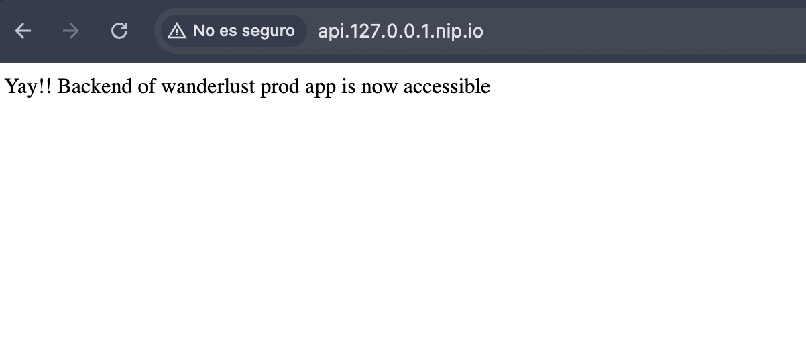
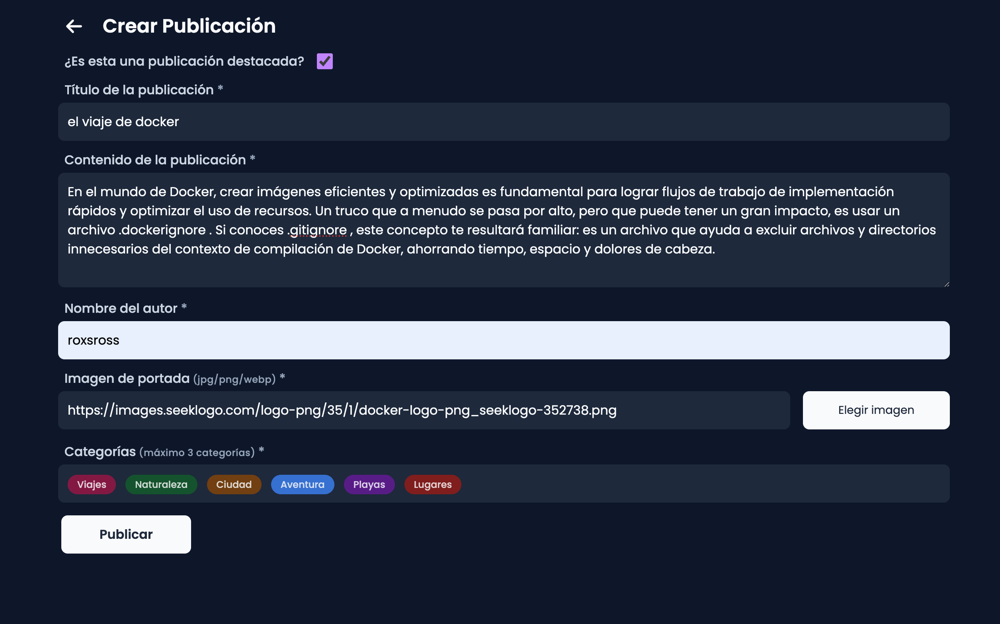
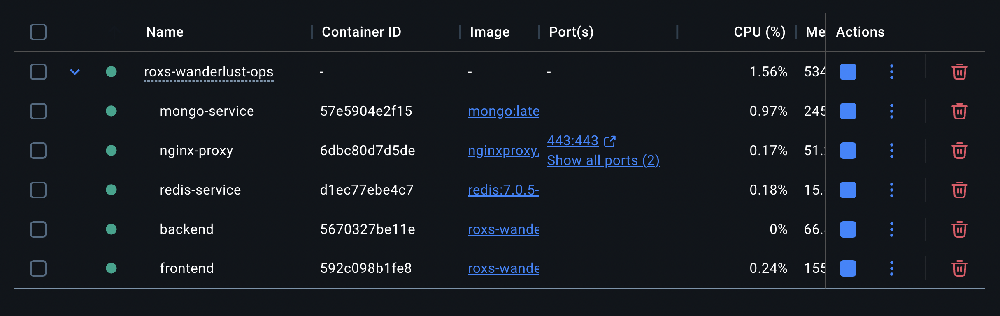
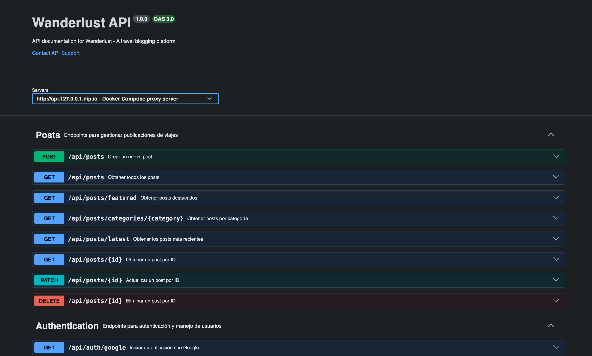
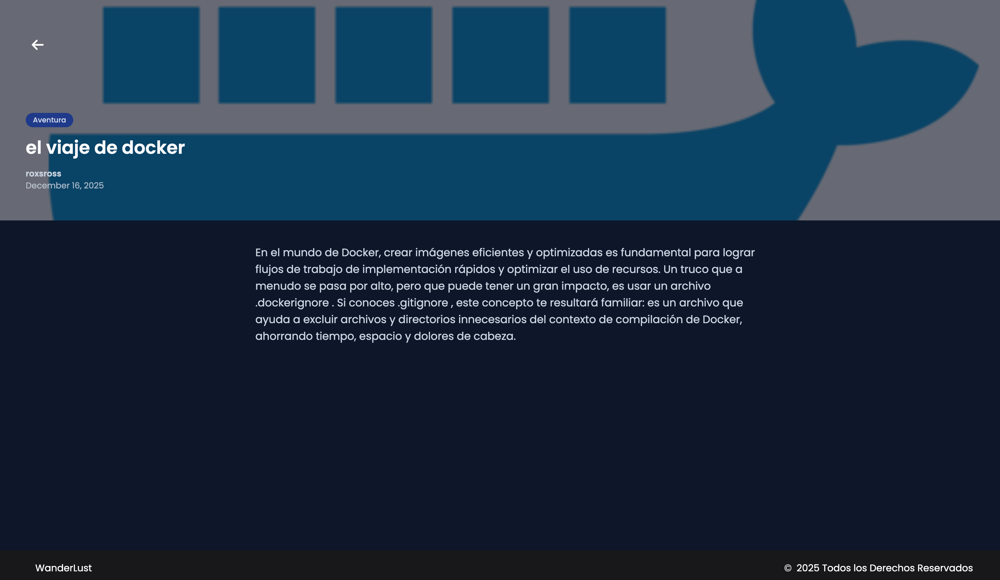

# 🌍 Roxs Wanderlust

<div align="center">



**Una aplicación de blog de viajes moderna construida con tecnologías cloud-native**

[](https://nodejs.org/)
[](https://reactjs.org/)
[](https://www.mongodb.com/)
[](https://www.docker.com/)
[](https://kubernetes.io/)

</div>

---

## 📋 Tabla de Contenidos

- [Acerca del Proyecto](#-acerca-del-proyecto)
- [Tecnologías](#-tecnologías)
- [Inicio Rápido](#-inicio-rápido)
- [Arquitectura](#-arquitectura)
- [Capturas de Pantalla](#-capturas-de-pantalla)
- [Documentación Completa](#-documentación-completa)
- [Contribuir](#-contribuir)

---

## 🎯 Acerca del Proyecto

**Roxs Wanderlust** es una plataforma moderna de blog de viajes diseñada con arquitectura de microservicios, lista para despliegue en contenedores y cloud-native. El proyecto demuestra mejores prácticas en desarrollo full-stack, contenedorización y orquestación con Kubernetes.

Este proyecto es una implementación mejorada del proyecto open-source [Wanderlust](https://github.com/krishnaacharyaa/wanderlust) de Krishna Acharya, con enfoque en DevOps, containerización y mejores prácticas de desarrollo.

### ✨ Características Principales

- 🔐 **Autenticación completa** con JWT y OAuth (GitHub, Google)
- 📝 **Sistema CRUD** para posts de blog con categorías
- 🎨 **UI moderna y responsive** con React 18 y Tailwind CSS
- 💾 **Cache de alto rendimiento** con Redis
- 📊 **API documentada** con Swagger/OpenAPI 3.0
- 🐳 **100% Contenedorizado** con Docker y Docker Compose
- ☸️ **Kubernetes-ready** con manifiestos completos
- 🔄 **Multi-arquitectura** (AMD64, ARM64)

---

## 🛠 Tecnologías

<table>
<tr>
<td valign="top" width="50%">

### Backend
- **Runtime:** Node.js 21 Alpine
- **Framework:** Express.js
- **Base de Datos:** MongoDB
- **Cache:** Redis 7.0.5
- **Autenticación:** JWT, OAuth2
- **API Docs:** Swagger UI

</td>
<td valign="top" width="50%">

### Frontend
- **Framework:** React 18
- **Lenguaje:** TypeScript
- **Build Tool:** Vite
- **Styling:** Tailwind CSS
- **UI Components:** Shadcn/ui
- **Testing:** Jest + React Testing Library

</td>
</tr>
</table>

### Infraestructura

- **Contenedores:** Docker, Docker Compose
- **Orquestación:** Kubernetes (Minikube)
- **Proxy:** NGINX Ingress Controller
- **Registry:** Docker Hub (roxsross12)

---

## 🚀 Inicio Rápido

### Prerrequisitos

```bash
# Verificar instalaciones requeridas
node --version  # v21+
docker --version  # 20.10+
docker-compose --version  # 2.0+
```

### Instalación en 3 Pasos

```bash
# 1. Clonar el repositorio
git clone https://github.com/roxsross/roxs-wanderlust-ops.git
cd roxs-wanderlust-ops

# 2. Configurar variables de entorno
cp .env.example backend/.env
# Editar backend/.env con tus credenciales

# 3. Iniciar con Docker Compose
docker-compose up --build
```

🎉 **¡Listo!** Accede a:
- 🌐 **Frontend:** http://localhost
- 🔌 **API:** http://localhost:8080/api
- 📚 **Swagger:** http://localhost:8080/api-docs

> 💡 **Tip:** Para instalación detallada, opciones de despliegue y troubleshooting, consulta la [Documentación Completa](#-documentación-completa)

---

## 🏗 Arquitectura

### Arquitectura Docker Compose



### Arquitectura Kubernetes



### Flujo de Datos



> 📝 **Nota:** Los Dockerfiles y objetos de Kubernetes incluidos en este repositorio son de referencia y pueden requerir ajustes según tu entorno.

---

## 📸 Capturas de Pantalla

<table>
  <tr>
    <td align="center" width="33%">
      
      <br />
      <b>Pagina principal</b>
      <br />
      <sub>Frontend</sub>
    </td>
    <td align="center" width="33%">
      
      <br />
      <b>Backend</b>
      <br />
      <sub>Backend</sub>
    </td>
    <td align="center" width="33%">
      
      <br />
      <b>Crear Post</b>
      <br />
      <sub>Crea una post para la web</sub>
    </td>

  <tr>
    <td align="center" width="33%">
      
      <br />
      <b>Contenedores</b>
      <br />
      <sub>Contendores en ejecución</sub>
    </td>
    <td align="center" width="33%">
      
      <br />
      <b>Swagger</b>
      <br />
      <sub>Documentacion de api con Swagger</sub>
    </td>
    <td align="center" width="33%">
      
      <br />
      <b>📰 Feed de Posts</b>
      <br />
      <sub>Exploración de contenido</sub>
    </td>
  </tr>
</table>

---

## 📚 Documentación Completa

Toda la documentación detallada está organizada en [Assets/docs/](./Assets/docs/):

### 🚀 Guías de Inicio

| Documento | Descripción | Link |
|-----------|-------------|------|
| **🎯 Getting Started** | Guía completa de instalación para todos los entornos | [Ver Guía](./Assets/docs/GETTING-STARTED.md) |
| **💻 Development** | Workflows de desarrollo, scripts y testing | [Ver Guía](./Assets/docs/DEVELOPMENT.md) |
| **🤝 Contributing** | Cómo contribuir al proyecto | [Ver Guía](./Assets/docs/CONTRIBUTING.md) |

### 🐳 Despliegue con Docker

| Documento | Descripción | Link |
|-----------|-------------|------|
| **🐳 Docker Compose** | Ejecutar con Docker Compose, comandos, troubleshooting | [Ver Guía](./Assets/docs/DOCKER-COMPOSE-GUIDE.md) |

**Contenido destacado:**
- ✅ Instalación y configuración
- ✅ Comandos esenciales
- ✅ Variables de entorno
- ✅ Troubleshooting común
- ✅ Monitoreo y logs

### ☸️ Despliegue con Kubernetes

| Documento | Descripción | Link |
|-----------|-------------|------|
| **☸️ Kubernetes** | Despliegue en Kubernetes, manifiestos, best practices | [Ver Guía](./Assets/docs/KUBERNETES-GUIDE.md) |

**Contenido destacado:**
- ✅ Setup de Minikube
- ✅ Despliegue completo
- ✅ ConfigMaps y Secrets
- ✅ Ingress Controller
- ✅ Troubleshooting avanzado

### 📖 API Documentation

<details>
<summary><strong>📚 Swagger API Documentation</strong> - Click para expandir</summary>

<br/>

| Documento | Descripción | Link |
|-----------|-------------|------|
| **📖 Swagger Guide** | Cómo usar Swagger UI, testing de endpoints | [Ver Guía](./Assets/docs/SWAGGER-GUIDE.md) |

#### Acceder a Swagger UI

La API está completamente documentada con OpenAPI 3.0 y accesible en:

**Docker Compose:**
- http://localhost:8080/api-docs
- http://api.127.0.0.1.nip.io/api-docs

**Kubernetes:**
- http://api.wanderlust.127.0.0.1.nip.io/api-docs

**Producción:**
- https://your-domain.com/api-docs

#### Endpoints Principales

```bash
# Autenticación
POST   /api/auth/register      # Registro de usuario
POST   /api/auth/login         # Login
POST   /api/auth/logout        # Logout
GET    /api/auth/github        # OAuth GitHub
GET    /api/auth/google        # OAuth Google

# Posts
GET    /api/posts              # Listar todos los posts
GET    /api/posts/:id          # Obtener post por ID
POST   /api/posts              # Crear post (requiere auth)
PUT    /api/posts/:id          # Actualizar post (requiere auth)
DELETE /api/posts/:id          # Eliminar post (requiere auth)
```

</details>


---

<div align="center">

**⭐ Si este proyecto te resulta útil, considera darle una estrella en GitHub ⭐**

[🐛 Reportar Bug](https://github.com/roxsross/roxs-wanderlust-ops/issues) · [✨ Solicitar Feature](https://github.com/roxsross/roxs-wanderlust-ops/issues) · [💬 Discusiones](https://github.com/roxsross/roxs-wanderlust-ops/discussions)

</div>

⭐ **Proyecto Original**

🔗 **Proyecto Original**: [krishnaacharyaa/wanderlust](https://github.com/krishnaacharyaa/wanderlust)


---


## 🚀 Quick Start - Guía de Setup (Proyecto Final Bootcamp DevOps: Contenedores y Orquestación)

Querés levantar este proyecto en tu entorno local?

**Tenemos una guía completa paso a paso:** **[SETUP.md](SETUP.md)**

**Qué incluye la guía:**

| **Paso** | **Descripción** | **Tiempo** |
|---|---|---|
| 1 | Clonar repositorio + Crear cluster Kind | 5 min |
| 2 | Crear secrets (backend + Grafana) | 3 min |
| 3 | Aplicar manifiestos de Kubernetes | 5 min |
| 4 | Seed de base de datos MongoDB | 3 min |
| 5 | Instalar Prometheus + Grafana | 5 min |
| 6 | Instalar ArgoCD (opcional) | 5 min |
| 7 | Verificar y acceder a la app | 5 min |
| **TOTAL** | **Setup completo** | **~30 min** |

**La guía incluye:**
- ✅ Prerrequisitos y versiones de herramientas
- ✅ Comandos copy-paste para cada paso
- ✅ Troubleshooting de errores comunes
- ✅ Limitaciones conocidas y workarounds
- ✅ Links a recursos adicionales

**Listo para empezar?** → **[Ir a SETUP.md](SETUP.md)**

---

## ⭐ Modificaciones Realizadas (Proyecto Final Bootcamp DevOps: Contenedores y Orquestación)

> **Nota:** Este repositorio es un fork del proyecto original [roxs-wanderlust-ops](https://github.com/roxsross/roxs-wanderlust-ops). Las siguientes modificaciones fueron implementadas como parte del **Proyecto Final del Bootcamp DevOps: Contenedores y Orquestación** por [@emaf13](https://github.com/emaf13).

### 🚀 CI/CD con GitHub Actions

**Archivos agregados:**

- `.github/workflows/ci-backend.yml` - CI para backend (build, test, security, push)
- `.github/workflows/ci-frontend.yml` - CI para frontend (build, security, push)
- `.github/workflows/cd-deploy.yml` - CD para Kubernetes (deploy automático)

**Estado del Pipeline:**

| **Workflow** | **Trigger** | **Estado** |
|---|---|---|
| CI - Backend | Push a main/master | ✅ Funcional |
| CI - Frontend | Push a main/master | ✅ Funcional |
| CD - Deploy | Después de CI exitoso | ⚠️ Requiere cloud K8s |

**Características:**

- Build automático de Docker images con tag del commit SHA
- Tests automáticos con `npm ci` y `npm test`
- Escaneo de seguridad con **Trivy** (CRITICAL/HIGH vulnerabilities)
- Push a Docker Hub con tags `latest` y `<commit-sha>`
- Deploy automático a Kubernetes con health checks

**Ver en GitHub:** https://github.com/emaf13/wanderlust-ops/actions

---

### 🔄 GitOps con ArgoCD

**Implementación:**

- ArgoCD instalado en el cluster (namespace `argocd`)
- Application configurada para sync automático desde el repo
- Self-healing y auto-prune habilitados

**Acceso a la UI:**

```bash
kubectl port-forward svc/argocd-server -n argocd 8080:443
# URL: https://localhost:8080
# Usuario: admin
# Password: kubectl -n argocd get secret argocd-initial-admin-secret -o jsonpath="{.data.password}" | base64 -d
```

**Ver estado:**

```bash
kubectl get applications -n argocd
```

---

### 📊 Observabilidad (Prometheus + Grafana)

**Implementación:**

- Prometheus instalado para recolección de métricas
- Grafana instalado para visualización (dashboards pre-configurados)
- Alertmanager configurado para alertas
- Node Exporter para métricas de nodos

**Acceso:**

```bash
# Grafana
kubectl port-forward -n monitoring svc/monitoring-grafana 3000:80
# URL: http://localhost:3000
# Usuario: admin
# Password: <guardada en secret grafana-admin-secret>

# Prometheus
kubectl port-forward -n monitoring svc/monitoring-prometheus 9090:9090
# URL: http://localhost:9090
```

**Dashboards disponibles:**

- Kubernetes / Compute Resources / Cluster
- Kubernetes / Compute Resources / Namespace (pods)
- Prometheus / Overview
- Node Exporter / Nodes

---

### 🔒 Seguridad Implementada

| **Medida** | **Implementación** | **Estado** |
|---|---|---|
| **Escaneo de vulnerabilidades** | Trivy en CI pipeline | ✅ Implementado |
| **Gestión de secrets** | Kubernetes Secrets (excluidos de git) | ✅ Implementado |
| **Non-root containers** | Usuarios no-root en Dockerfiles | ✅ Implementado |
| **Resource limits** | CPU/Memory limits en deployments | ✅ Implementado |
| **Network policies** | Services con puertos específicos | ✅ Implementado |
| **Image tags** | Tags específicos (no solo latest) | ✅ Implementado |

**Secrets excluidos de git:**

```bash
# .gitignore incluye:
kubernetes/secret.yaml
kubernetes/grafana-secret.yaml

# Template seguro disponible:
kubernetes/grafana-secret.yaml.template
```

**Crear secrets manualmente:**

```bash
# Backend JWT Secret
kubectl create secret generic backend-secret -n wanderlust \
  --from-literal=JWT_SECRET="$(openssl rand -hex 32)"

# Grafana Admin Password
kubectl create secret generic grafana-admin-secret -n monitoring \
  --from-literal=admin-user="admin" \
  --from-literal=admin-password="$(openssl rand -hex 16)"
```

---

### 🐛 Fixes Implementados

| **Problema**             | **Solución**                                       | **Archivos modificados**      |
| ------------------------ | -------------------------------------------------- | ----------------------------- |
| Frontend image rendering | API devuelve `imageLink`, frontend usa `imageLink` | frontend/src/components/*.tsx |
| Featured posts vacíos    | Campo `isFeaturedPost` en MongoDB                  | Seed script corregido         |
| Nginx permissions        | SecurityContext ajustado                           | kubernetes/frontend.yaml      |
| Health check backend     | TCP socket en lugar de HTTP                        | kubernetes/backend.yaml       |

---

### ⚠️ Limitaciones Conocidas

| **Limitación**        | **Descripción**                               | **Impacto**                                  | **Workaround**                                      |
| --------------------- | --------------------------------------------- | -------------------------------------------- | --------------------------------------------------- |
| **CD GitHub Actions** | Requiere cluster K8s accesible desde internet | Deploy automático no funciona con Kind local | Usar ArgoCD para GitOps local                       |
| **Kind local**        | No tiene LoadBalancer real                    | Ingress requiere port-forward                | `kubectl port-forward` para testing                 |
| **Imágenes Unsplash** | URLs externas pueden expirar                  | Algunas imágenes pueden no cargar            | Seed DB con URLs válidas                            |
| **Logs (Loki)**       | No instalado                                  | No hay agregación de logs centralizada       | Logs disponibles via `kubectl logs`                 |
| **Traces (Tempo)**    | No instalado                                  | No hay distributed tracing                   | Se implementará a futuro. No requerido por bootcamp |
| **Password Grafana**  | En Kubernetes Secret (no en git)              | Requiere creación manual del secret          | Documentado en template                             |

---

### 📝 Decisiones de Diseño

| **Decisión** | **Opciones Consideradas** | **Elección** | **Justificación** |
|---|---|---|---|
| **CI/CD Platform** | GitHub Actions vs GitLab CI vs Jenkins | GitHub Actions | Integración nativa con el repo, gratuito para proyectos públicos |
| **GitOps Tool** | ArgoCD vs Flux | ArgoCD | UI intuitiva, comunidad activa, mejor documentación |
| **Container Registry** | Docker Hub vs ECR vs GCR | Docker Hub | Gratuito, simple, suficiente para el proyecto |
| **Kubernetes Local** | Kind vs Minikube vs Docker Desktop | Kind | Liviano, rápido, diseñado para CI/CD testing |
| **Health Checks** | HTTP vs TCP | TCP (backend) | Más simple, menos puntos de fallo para este caso |
| **Secret Management** | Sealed Secrets vs Kubernetes Secrets | K8s Secrets | Suficiente para proyecto académico, menos complejidad |
| **Observabilidad** | Prometheus+Grafana vs Datadog vs New Relic | Prometheus+Grafana | Open source, estándar de la industria, self-hosted |

---

## 🎓 Proyecto Final Bootcamp DevOps Contenedores y Orquestación

### Requerimientos Cubiertos

| **Requerimiento** | **Estado** | **Evidencia** |
|---|---|---|
| Cluster Kubernetes | ✅ | Kind local funcionando |
| App desplegada | ✅ | Frontend + Backend + MongoDB + Redis |
| CI/CD Pipeline | ✅ | GitHub Actions (CI funcional, CD documentado) |
| GitOps con ArgoCD | ✅ | Application configurada con auto-sync |
| Observabilidad | ✅ | Prometheus + Grafana instalados |
| Seguridad (SAST) | ✅ | Trivy scanning en CI |
| Gestión de Secrets | ✅ | Kubernetes Secrets excluidos de git |
| Documentación | ✅ | Este README |

### Cómo Evaluar Este Proyecto

1. **CI/CD Pipeline:**
   - Ver [GitHub Actions](https://github.com/emaf13/wanderlust-ops/actions)
   - Verificar que CI Backend y Frontend pasan ✅
   - Ver logs de Trivy scanning

2. **Docker Images:**
   - Backend: https://hub.docker.com/r/emaf13/wanderlust-backend
   - Frontend: https://hub.docker.com/r/emaf13/wanderlust-frontend

3. **ArgoCD:**

```bash
kubectl get applications -n argocd
```

4. **Grafana Dashboards:**

```bash
kubectl port-forward -n monitoring svc/monitoring-grafana 3000:80 &
# http://localhost:3000
```

5. **App Local:**

```bash
# Crear cluster
kind create cluster --name wanderlust-final

# Crear secrets
kubectl create secret generic backend-secret -n wanderlust \
  --from-literal=JWT_SECRET="$(openssl rand -hex 32)"

kubectl create secret generic grafana-admin-secret -n monitoring \
  --from-literal=admin-user="admin" \
  --from-literal=admin-password="$(openssl rand -hex 16)"

# Deploy
kubectl apply -f kubernetes/

# Verificar
kubectl get pods -n wanderlust
kubectl get pods -n monitoring

# Port-forward
kubectl port-forward -n wanderlust svc/frontend-service 8000:80
```

---

## 📊 Estado del Proyecto

**Última actualización:** Marzo 2026

| **Componente** | **Versión** | **Estado** |
|---|---|---|
| Kubernetes | 1.35 (Kind) | ✅ Estable |
| Backend | v1.0.2 | ✅ Funcional |
| Frontend | v1.0.5 | ✅ Funcional |
| MongoDB | 7.0 | ✅ Estable |
| Redis | latest | ✅ Estable |
| ArgoCD | latest | ✅ Synced |
| Prometheus | v3.10.0 | ✅ Funcional |
| Grafana | latest | ✅ Funcional |

---

## 🤝 Contribuir

Este es un proyecto académico del Bootcamp DevOps: Contenedores y Orquestación. Para contribuciones reales, por favor referirse al repositorio original.

---

## 📄 Licencia

Misma licencia que el repositorio original.

---

## 👤 Autor de las Modificaciones

**Ema** - [@emaf13](https://github.com/emaf13)

Proyecto Final Bootcamp DevOps: Contenedores y Orquestación - Marzo 2026

---

