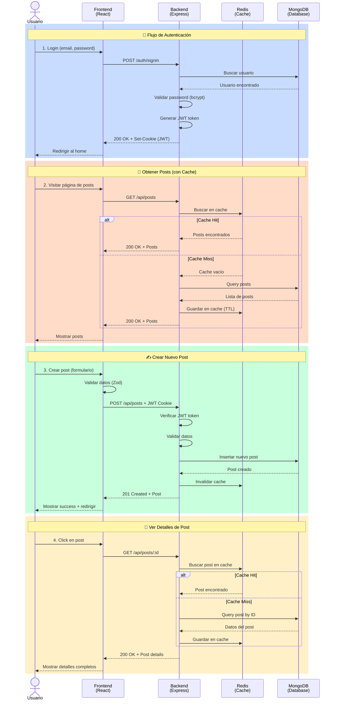
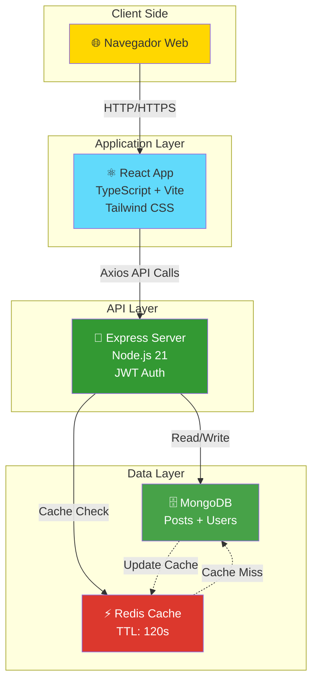
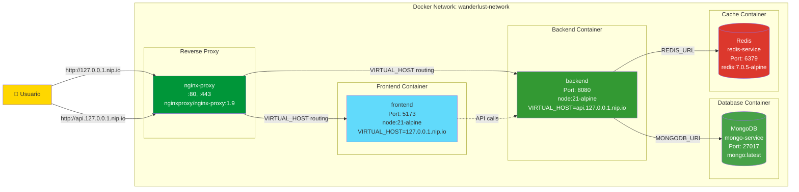
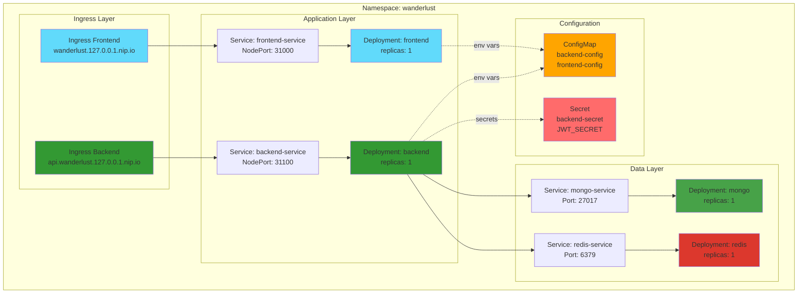

# 🌍 Roxs Wanderlust Ops

<div align="center">


</div>

## El Blog de Viajes Definitivo 🌍 ✈️ para Ti

Una aplicación fullstack de blog de viajes moderna y escalable, construida con React, Node.js, MongoDB y Redis. Este proyecto es una implementación mejorada del proyecto open-source [Wanderlust](https://github.com/krishnaacharyaa/wanderlust) de Krishna Acharya.

<div align="center">
  
</div>

## 📋 Descripción

Wanderlust es una plataforma de blog de viajes que permite a los usuarios compartir sus experiencias, descubrir nuevos destinos y conectar con otros viajeros. La aplicación cuenta con autenticación de usuarios, creación de posts, sistema de categorías y caché con Redis para optimizar el rendimiento.

## 🎯 Objetivo del Proyecto

Este proyecto tiene dos objetivos principales:

1. **Iniciar tu Viaje en Open Source**: Diseñado para facilitar tu entrada al mundo del código abierto. Aquí aprenderás los fundamentos de Git y obtendrás un dominio sólido del stack MERN. Creemos firmemente que aprender y construir deben ir de la mano.

2. **Dominio de React**: Una vez que domines los conceptos básicos, comienza una nueva aventura de maestría en React. Este proyecto cubre todo, desde validación de formularios simples hasta mejoras avanzadas de rendimiento.

> [!NOTE]
> **📦 Sobre los Dockerfiles y Manifiestos de Kubernetes**
> 
> Los Dockerfiles y objetos de Kubernetes incluidos en este repositorio son **configuraciones de referencia** diseñadas para ayudarte a comenzar rápidamente. Este proyecto es un **desafío abierto** para que explores, experimentes y mejores estas configuraciones según tus necesidades.
> 
> **Te invitamos a:**
> - 🔧 Optimizar los Dockerfiles (multi-stage builds, caché, security)
> - ☸️ Mejorar los manifiestos de Kubernetes (health checks, resources, autoscaling)
> - 🚀 Implementar CI/CD pipelines
> - 🔒 Fortalecer la seguridad (secrets management, network policies)
> - 📊 Agregar monitoring y observabilidad
> - 🌐 Configurar para producción real
> 
> **¡Este es tu sandbox para aprender DevOps y Cloud Native!** 💪

## 🚀 Características

<div align="center">
  
</div>

- ⭐ **Posts Destacados**: Resalta las mejores historias y destinos de viaje en la página principal para mostrar el mejor contenido e inspirar a los lectores con experiencias emocionantes
- ✨ **Interfaz Intuitiva**: Navega sin esfuerzo a través de contenido de viaje cautivador con nuestro diseño intuitivo y moderno
- 🔍 **Descubrir por Categorías**: Explora diversas experiencias de viaje categorizadas por Viaje, Naturaleza, Ciudad, Aventura y Playas
- 📝 **Gestión Completa de Posts**: Crear, leer, actualizar y explorar publicaciones de viajes con editor enriquecido
- 🔐 **Autenticación Segura**: Sistema JWT robusto con cookies HTTP-only y encriptación bcryptjs
- 🎨 **UI Elegante**: Styled con Tailwind CSS y componentes personalizados con shadcn/ui
- 🏷️ **Sistema de Tags**: Organización flexible por destinos, tipos de viaje y etiquetas personalizadas
- ⚡ **Caché con Redis**: Optimización de consultas frecuentes para rendimiento máximo
- 🐳 **Completamente Dockerizado**: Deployment completo con Docker Compose para desarrollo y producción
- 🧪 **Testing Comprehensivo**: Suite completa de tests unitarios e integración con Jest y Supertest
- 🌓 **Dark Mode**: Soporte completo para tema oscuro con toggle dinámico
- 📱 **Diseño Responsive**: Experiencia optimizada para móviles, tablets y escritorio
- ♿ **Accesibilidad**: Componentes accesibles siguiendo estándares WCAG

### 📸 Capturas de Pantalla

<table>
  <tr>
    <td align="center" width="33%">
      
      <br />
      <b>Pagina principal</b>
      <br />
      <sub>Frontend</sub>
    </td>
    <td align="center" width="33%">
      
      <br />
      <b>Backend</b>
      <br />
      <sub>Backend</sub>
    </td>
    <td align="center" width="33%">
      
      <br />
      <b>Crear Post</b>
      <br />
      <sub>Crea una post para la web</sub>
    </td>

  <tr>
    <td align="center" width="33%">
      
      <br />
      <b>Contenedores</b>
      <br />
      <sub>Contendores en ejecución</sub>
    </td>
    <td align="center" width="33%">
      
      <br />
      <b>Swagger</b>
      <br />
      <sub>Documentacion de api con Swagger</sub>
    </td>
    <td align="center" width="33%">
      
      <br />
      <b>📰 Feed de Posts</b>
      <br />
      <sub>Exploración de contenido</sub>
    </td>
  </tr>
</table>

## Arquitectura y Flujo de Funcionamiento

### Diagrama de Secuencia - Flujos Principales



### 📊 Componentes del Sistema



##  Stack Tecnológico

### Frontend
- React 18 con TypeScript
- Vite como build tool
- Tailwind CSS para estilos
- React Router para navegación
- React Hook Form + Zod para formularios
- Axios para peticiones HTTP
- Jest + React Testing Library

### Backend
- Node.js + Express
- MongoDB con Mongoose
- Redis para caché
- JWT para autenticación
- bcryptjs para encriptación
- Jest + Supertest para testing

### DevOps
- Docker & Docker Compose
- MongoDB oficial image
- Redis Alpine
- Nodemon para desarrollo

## 📦 Requisitos Previos

- Node.js (v18 o superior)
- npm o yarn
- Docker y Docker Compose (opcional, para deployment containerizado)
- MongoDB (si no usas Docker)
- Redis (si no usas Docker)

## 📚 Documentación Completa

Este proyecto incluye guías detalladas ubicadas en [`Assets/docs/`](Assets/docs/) para diferentes aspectos del despliegue:

### 🐳 Despliegue con Contenedores

<table>
  <tr>
    <td width="50%" valign="top">
      <h4>📦 <a href="Assets/docs/DOCKER-COMPOSE-GUIDE.md">Docker Compose Guide</a></h4>
      <p>Guía completa para ejecutar la aplicación con Docker Compose</p>
      <ul>
        <li>✅ Comandos principales (up, down, build, logs)</li>
        <li>✅ Workflows comunes de desarrollo</li>
        <li>✅ Troubleshooting y solución de problemas</li>
        <li>✅ Monitoreo y recursos del sistema</li>
        <li>✅ Escalado de servicios</li>
        <li>✅ Actualización de imágenes</li>
        <li>✅ Backups de base de datos</li>
        <li>✅ Variables de entorno</li>
      </ul>
      <blockquote>
        📄 <strong>Ideal para:</strong> Desarrollo local y staging rápido
      </blockquote>
    </td>
    <td width="50%" valign="top">
      <h4>☸️ <a href="Assets/docs/KUBERNETES-GUIDE.md">Kubernetes Guide</a></h4>
      <p>Despliegue en Kubernetes paso a paso</p>
      <ul>
        <li>✅ Comandos kubectl esenciales</li>
        <li>✅ Configuración de recursos (ConfigMaps, Secrets)</li>
        <li>✅ Health checks y readiness probes</li>
        <li>✅ Debugging de pods y servicios</li>
        <li>✅ Escalado horizontal (HPA)</li>
        <li>✅ Port forwarding y acceso a servicios</li>
        <li>✅ Mejores prácticas de producción</li>
        <li>✅ Monitoreo con kubectl top</li>
      </ul>
      <blockquote>
        📄 <strong>Ideal para:</strong> Producción y entornos cloud
      </blockquote>
    </td>
  </tr>
</table>

### 📖 Documentación del API

<table>
  <tr>
    <td width="100%" valign="top">
      <h4>🔧 <a href="Assets/docs/SWAGGER-GUIDE.md">Swagger UI Guide</a></h4>
      <p>Documentación interactiva del API REST con Swagger</p>
      
      <details>
        <summary><strong>🎯 Contenido de la guía</strong></summary>
        <br/>
        <ul>
          <li>✅ Acceso a Swagger UI (local, Docker, Kubernetes)</li>
          <li>✅ Cómo probar endpoints interactivamente</li>
          <li>✅ Ejemplos prácticos de cada endpoint</li>
          <li>✅ Flujos de autenticación (OAuth + JWT)</li>
          <li>✅ Validaciones y códigos de respuesta</li>
          <li>✅ Configuración con dominios personalizados</li>
          <li>✅ Setup para producción con SSL/HTTPS</li>
          <li>✅ Configuración de CORS</li>
          <li>✅ Múltiples servidores (dev, staging, prod)</li>
        </ul>
      </details>
      
      <p><strong>🌐 URLs de acceso:</strong></p>
      <ul>
        <li>🐳 Docker: <code>http://api.127.0.0.1.nip.io/api-docs</code></li>
        <li>☸️ Kubernetes: <code>http://api.wanderlust.127.0.0.1.nip.io/api-docs</code></li>
        <li>💻 Local: <code>http://localhost:8080/api-docs</code></li>
      </ul>
      
      <blockquote>
        📄 <strong>Ideal para:</strong> Testing, documentación del API, integración con frontend
      </blockquote>
    </td>
  </tr>
</table>

### 📂 Estructura de Documentación

```
Assets/docs/
├── 📦 DOCKER-COMPOSE-GUIDE.md    # Docker Compose completo
├── ☸️ KUBERNETES-GUIDE.md         # Kubernetes desde cero
└── 📖 SWAGGER-GUIDE.md            # API documentation
```

> [!TIP]
> **💡 Recomendación de lectura:**
> 1. Empieza con **Docker Compose** para desarrollo local
> 2. Lee **Swagger Guide** para entender el API
> 3. Avanza a **Kubernetes** cuando estés listo para producción

## �🔧 Instalación

### Opción 1: Instalación Local

1. **Clonar el repositorio**
```bash
git clone <repository-url>
cd roxs-wanderlust-ops
```

2. **Instalar todas las dependencias**
```bash
npm run installer
```

Este comando instalará las dependencias del root, backend y frontend automáticamente.

3. **Configurar variables de entorno**

Backend (`backend/.env`):
```env
PORT=8080
MONGODB_URI=mongodb://localhost:27017/wanderlust
JWT_SECRET=tu_secreto_jwt_aqui
REDIS_HOST=localhost
REDIS_PORT=6379
NODE_ENV=development
```

Frontend (`frontend/.env`):
```env
VITE_API_URL=http://localhost:8080/api
```

4. **Iniciar MongoDB y Redis localmente**
```bash
# MongoDB
mongod

# Redis
redis-server
```

5. **Iniciar la aplicación**
```bash
npm start
```

Esto iniciará el frontend en `http://localhost:5173` y el backend en `http://localhost:8080`.

### Opción 2: Con Docker Compose (local) 🐳



**Arquitectura de Contenedores:**

1. **Clonar el repositorio**
```bash
git clone <repository-url>
cd roxs-wanderlust-ops
```

2. **Levantar todos los servicios**
```bash
docker-compose up -d
```

3. **Acceder a la aplicación**

| Servicio | URL | Descripción |
|----------|-----|-------------|
| 🎨 Frontend | `http://127.0.0.1.nip.io` | Aplicación web |
| 🔌 Backend API | `http://api.127.0.0.1.nip.io` | REST API |
| 📖 Swagger UI | `http://api.127.0.0.1.nip.io/api-docs` | Documentación interactiva |
| 🗄️ MongoDB | `localhost:27017` | Base de datos |
| ⚡ Redis | `localhost:6379` | Caché |

**📖 Ver la [Guía Completa de Docker Compose](Assets/docs/DOCKER-COMPOSE-GUIDE.md)** para comandos avanzados, troubleshooting y mejores prácticas.

### Opción 3: Con Kubernetes ☸️



**Arquitectura de Recursos:**

```bash
# Crear namespace
kubectl apply -f kubernetes/namespace.yaml

# Aplicar configuración
kubectl apply -f kubernetes/configmap.yaml
kubectl apply -f kubernetes/secret.yaml

# Desplegar servicios
kubectl apply -f kubernetes/mongodb.yaml
kubectl apply -f kubernetes/redis.yaml
kubectl apply -f kubernetes/backend.yaml
kubectl apply -f kubernetes/frontend.yaml
kubectl apply -f kubernetes/ingress.yaml

# Verificar
kubectl get all -n wanderlust
```

**Acceso:**
- Frontend: `http://wanderlust.127.0.0.1.nip.io`
- Backend: `http://api.wanderlust.127.0.0.1.nip.io`
- Swagger: `http://api.wanderlust.127.0.0.1.nip.io/api-docs`

**📖 Ver la [Guía Completa de Kubernetes](Assets/docs/KUBERNETES-GUIDE.md)** para configuración detallada, troubleshooting y comandos útiles.

## 📝 Scripts Disponibles

### Root
```bash
npm start              # Inicia frontend y backend concurrentemente
npm run installer      # Instala todas las dependencias
npm run start-frontend # Solo inicia el frontend
npm run start-backend  # Solo inicia el backend
```

### Backend
```bash
npm start              # Inicia el servidor con nodemon
npm test               # Ejecuta tests con coverage
npm run format         # Formatea código con Prettier
npm run check          # Verifica formato del código
```

### Frontend
```bash
npm run dev            # Inicia servidor de desarrollo
npm run build          # Build para producción
npm run preview        # Preview del build de producción
npm test               # Ejecuta tests
npm run lint           # Linter con ESLint
npm run format         # Formatea código con Prettier
```

## 🏗️ Estructura del Proyecto

```
roxs-wanderlust-ops/
├── backend/              # API REST con Node.js/Express
│   ├── api/             # Entry point para Vercel
│   ├── config/          # Configuración de DB y utilidades
│   ├── controllers/     # Lógica de negocio
│   ├── models/          # Modelos de MongoDB
│   ├── routes/          # Definición de rutas
│   ├── services/        # Servicios (Redis, etc.)
│   ├── utils/           # Utilidades y middleware
│   └── tests/           # Tests unitarios e integración
├── frontend/            # SPA con React + TypeScript
│   ├── src/
│   │   ├── components/  # Componentes reutilizables
│   │   ├── pages/       # Páginas de la aplicación
│   │   ├── layouts/     # Layouts (header, footer)
│   │   ├── utils/       # Funciones auxiliares
│   │   └── types/       # Tipos de TypeScript
│   └── public/          # Assets estáticos
├── database/            # Configuración de base de datos
└── docker-compose.yml   # Orquestación de contenedores
```

## 🧪 Testing

### Backend
```bash
cd backend
npm test
```
- Tests unitarios de controladores
- Tests de integración de API
- Coverage reports generados automáticamente

### Frontend
```bash
cd frontend
npm test
```
- Tests de componentes con React Testing Library
- Tests de integración de páginas
- Mocks configurados para assets

## 🐳 Docker

### Servicios en Docker Compose

| Servicio | Puerto | Descripción |
|----------|--------|-------------|
| frontend | 5173 | Aplicación React |
| backend | 31100 | API REST |
| mongodb | 27017 | Base de datos |
| redis | 6379 | Caché (interno) |

### Comandos útiles de Docker

```bash
# Levantar servicios
docker-compose up -d

# Ver logs
docker-compose logs -f [servicio]

# Detener servicios
docker-compose down

# Rebuild específico
docker-compose up --build [servicio]

# Acceder a MongoDB
docker exec -it mongo-service mongosh

# Acceder a Redis
docker exec -it redis-service redis-cli
```

## 🔐 Seguridad

- ✅ Passwords hasheados con bcryptjs
- ✅ JWT tokens almacenados en HTTP-only cookies
- ✅ CORS configurado
- ✅ Validación de entrada con Zod
- ✅ Variables de entorno para secretos
- ✅ Sanitización de datos con Mongoose

## 🌐 Demo

Visita la versión en vivo del proyecto original: [wanderlust-beta.vercel.app](https://wanderlust-beta.vercel.app/)

## 🙏 Créditos y Reconocimientos

Este proyecto es un fork/implementación basada en el proyecto open-source **Wanderlust** creado por [Krishna Acharya](https://github.com/krishnaacharyaa).

- 📦 **Repositorio Original**: [krishnaacharyaa/wanderlust](https://github.com/krishnaacharyaa/wanderlust)
- ⭐ **Stars**: 280+ estrellas en GitHub
- 🤝 **Contributors**: 44+ contribuidores
- 🏆 **Open Source Program**: Parte de GirlScript Summer of Code 2024

Agradecemos a todos los contribuidores del proyecto original por crear esta increíble base educativa para aprender el stack MERN.

### Mejoras en Esta Versión

- ✅ Integración completa de Redis para caché
- ✅ Dockerización completa con Docker Compose
- ✅ Scripts optimizados para desarrollo
- ✅ Configuración mejorada de ambiente
- ✅ Testing expandido
- ✅ Documentación en español

## 🤝 Contribución

Las contribuciones son bienvenidas. Por favor:

1. Fork el proyecto
2. Crea una rama para tu feature (`git checkout -b feature/AmazingFeature`)
3. Commit tus cambios (`git commit -m 'Add some AmazingFeature'`)
4. Push a la rama (`git push origin feature/AmazingFeature`)
5. Abre un Pull Request

## 📄 Licencia

Este proyecto es de código abierto y está disponible bajo la [Licencia MIT](LICENSE).

## 👥 Autores

- **Rox** - Implementación y mejoras operacionales
- **[Krishna Acharya](https://github.com/krishnaacharyaa)** - Proyecto original Wanderlust
- **Comunidad Open Source** - 44+ contribuidores del proyecto original

## 💻 Stack MERN

Este proyecto es un ejemplo completo del stack MERN:
- **M**ongoDB - Base de datos NoSQL
- **E**xpress.js - Framework web para Node.js
- **R**eact - Biblioteca de UI
- **N**ode.js - Entorno de ejecución JavaScript

Además incorpora:
- **TypeScript** para type safety
- **Redis** para caché distribuido
- **Docker** para containerización
- **Jest** para testing

## 🌟 Temas de GitHub

`react` `javascript` `typescript` `mern` `mern-stack` `mongodb` `express` `nodejs` `tailwind-css` `docker` `redis` `jwt` `blog` `travel` `webapp`

## 📞 Soporte

Si tienes alguna pregunta o problema:
- 🐛 Abre un [issue](../../issues) en el repositorio
- 💬 Consulta el proyecto original: [krishnaacharyaa/wanderlust](https://github.com/krishnaacharyaa/wanderlust)
- 📧 Contacta al equipo de desarrollo

## 💖 Muestra tu Apoyo

Si encuentras este proyecto interesante e inspirador, por favor considera mostrar tu apoyo dándole una estrella en GitHub. Tu estrella ayuda mucho a alcanzar más desarrolladores y nos anima a seguir mejorando el proyecto.

---

⭐ **Si te gusta este proyecto, no olvides darle una estrella en GitHub!**

🔗 **Proyecto Original**: [krishnaacharyaa/wanderlust](https://github.com/krishnaacharyaa/wanderlust)


